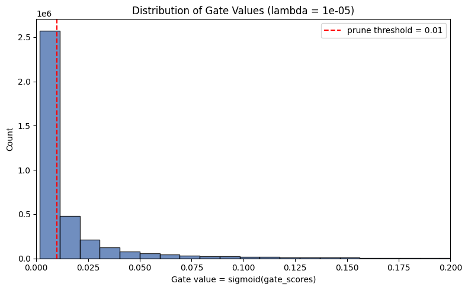

# The Self-Pruning Neural Network

A self-pruning feed-forward neural network classifier trained on CIFAR-10. This project demonstrates an end-to-end differentiable neural network pruning technique that learns per-weight connection gates simultaneously with classification weights via backpropagation and an $L_1$ sparsity penalty.

---

## 📌 Overview

Traditional neural network pruning often relies on post-hoc magnitude thresholding, multi-stage retraining, or complex heuristics. This project implements a **self-pruning architecture** where every synaptic connection dynamically decides whether to stay open or close during training.

### Key Highlights
- **`PrunableLinear` Layer**: A drop-in replacement for PyTorch's `nn.Linear` equipped with per-weight learnable gate scores.
- **End-to-End Differentiable**: Forward pass and gradient flow through both weights and gates utilize standard PyTorch autograd operations—no custom CUDA kernels or manual backward passes required.
- **$L_1$ Sparsity Regularization**: Promotes true parameter sparsity and produces a bimodal distribution of gates (near 0 for pruned, near 1 for active).
- **Dual Learning-Rate Strategy**: Employs separate Adam parameter groups for classification weights (`lr = 1e-3`) and gate scores (`lr = 1e-2`), ensuring fast gate convergence and stable weight updates.
- **Superior Regularization Performance**: At optimal sparsity ($\lambda = 1\times 10^{-5}$), the network achieves **64.62% sparsity while improving test accuracy to 58.20%** (outperforming the baseline ungated model).

---

## 🧠 Methodology & Theory

### 1. The `PrunableLinear` Layer

For an input vector $x$, a standard linear layer computes $y = x W^T + b$. In `PrunableLinear`:

$$\text{gates} = \sigma(s) = \frac{1}{1 + e^{-s}}$$

$$W_{\text{pruned}} = W \odot \text{gates}$$

$$y = x W_{\text{pruned}}^T + b$$

Where:
- $W \in \mathbb{R}^{d_{\text{out}} \times d_{\text{in}}}$: Standard classification weight matrix (initialized via Kaiming uniform).
- $s \in \mathbb{R}^{d_{\text{out}} \times d_{\text{in}}}$: Learnable `gate_scores` (initialized to $0$, meaning $\sigma(0) = 0.5$ so all connections start half-open).
- $b \in \mathbb{R}^{d_{\text{out}}}$: Optional bias term.
- $\odot$: Element-wise Hadamard product.

### 2. Why an $L_1$ Penalty on Sigmoid Gates Drives True Sparsity

The training objective optimizes:

$$\mathcal{L}_{\text{total}} = \mathcal{L}_{\text{CE}}(y, \hat{y}) + \lambda \sum_{l} \sum_{i,j} \sigma(s_{l,ij})$$

Because sigmoid outputs are strictly bounded in $(0, 1)$, the $L_1$ penalty is directly the sum of all gate values:
$$\frac{\partial \mathcal{L}_{\text{sparse}}}{\partial g_{ij}} = +1$$

Unlike an $L_2$ penalty (whose gradient diminishes to 0 as the value approaches 0), the $L_1$ loss applies a **constant downward pressure** of $+1$ to every gate, regardless of how small it already is:
- A connection survives only if the gradient of the task classification loss $\mathcal{L}_{\text{CE}}$ exerts a stronger upward counter-force.
- Connections that contribute minimally to classification accuracy lose this tug-of-war and are systematically driven down toward $0$.
- This results in a clear **bimodal gate distribution**: an overwhelming spike of dead connections at $0$, and a separate group of active connections surviving near $1$.

---

## 📊 Experimental Results

Experiments conducted on CIFAR-10 with a multi-layer perceptron architecture:
`3072 (Flattened 32x32x3) → 1024 → 512 → 256 → 10` (with ReLU activations and Dropout $p=0.2$):

| Sparsity Coefficient ($\lambda$) | Test Accuracy (%) | Sparsity Level (%) | Pruning Regime |
|---|---|---|---|
| **$1\times 10^{-6}$** (Low) | 57.72% | 7.01% | Under-pruning; minimal sparsity pressure, gates stay near initial state |
| **$1\times 10^{-5}$** (Medium) | **58.20%** | **64.62%** | **Optimal sweet spot: 64.6% of weights pruned with best generalization accuracy** |
| **$1\times 10^{-3}$** (High) | 44.99% | 99.97% | Over-pruning; network starved of capacity, accuracy drops sharply |

### Trade-off Insights
1. **Regularization Sweet Spot ($\lambda = 1\times 10^{-5}$)**: In over-parameterized networks, moderate $L_1$ gate regularization acts as an effective structure regularizer. Pruning noisy and redundant connections prevented overfitting, increasing test accuracy over the unpruned baseline ($58.20\%$ vs $57.72\%$).
2. **Accuracy Cliff ($\lambda = 1\times 10^{-3}$)**: When sparsity pressure is too aggressive, $99.97\%$ of connections are severed, leaving insufficient expressive capacity for CIFAR-10 classification.

---

## 📈 Gate Value Distribution

Below is the gate value distribution for the optimal model ($\lambda = 1\times 10^{-5}$) zoomed into the pruning boundary $[0.0, 0.2]$:



The red dashed line indicates the pruning threshold ($1\times 10^{-2}$). An overwhelming majority of connection gates are concentrated directly at $0.0$, demonstrating that the network cleanly eliminates irrelevant weights.

---

## 📁 Repository Structure

```text
├── Self_Pruning_Neural_Network.ipynb   # Interactive Jupyter notebook with complete workflow and outputs
├── self_pruning_nn.py                  # Standalone, runnable PyTorch training script with CLI args
├── gate_distribution.png               # Gate histogram visualization for the optimal model
├── requirements.txt                    # Project dependencies
└── .gitignore                          # Excludes caches, temporary artifacts, and checkpoints
```

---

## 🚀 Getting Started

### 1. Prerequisites & Installation

Clone this repository and install dependencies:

```bash
git clone https://github.com/ImLasya/Self_pruning_neural_network.git
cd Self_pruning_neural_network
pip install -r requirements.txt
```

### 2. Running via Python Script

Train the self-pruning network using the standalone CLI script:

```bash
# Run experiments across the three default lambda values
python self_pruning_nn.py

# Or customize hyperparameters
python self_pruning_nn.py --lambdas 1e-6 1e-5 1e-3 --epochs 15 --batch-size 256 --plot-output gate_distribution.png
```

### 3. Running via Jupyter Notebook

Launch Jupyter and open `Self_Pruning_Neural_Network.ipynb` to step through the modular sections:
```bash
jupyter notebook Self_Pruning_Neural_Network.ipynb
```

---

## 🛠️ Implementation Details

- **Autograd Verification**: Gradients flow through both weights and gate scores seamlessly:
  ```python
  # Sanity check
  layer = PrunableLinear(4, 3)
  x = torch.randn(2, 4, requires_grad=True)
  out = layer(x).sum()
  out.backward()
  assert layer.weight.grad is not None
  assert layer.gate_scores.grad is not None
  ```
- **Sparsity Metric**: Calculated as the percentage of all gates across all prunable layers with value $< 0.01$:
  $$\text{Sparsity} = \frac{\sum \mathbb{I}(g < 0.01)}{N_{\text{total weights}}} \times 100\%$$
- **Hardware Acceleration**: Automatically uses CUDA GPU acceleration if available, falling back to CPU.

---

## 📜 License
This project is open-source and available under the [MIT License](LICENSE).
